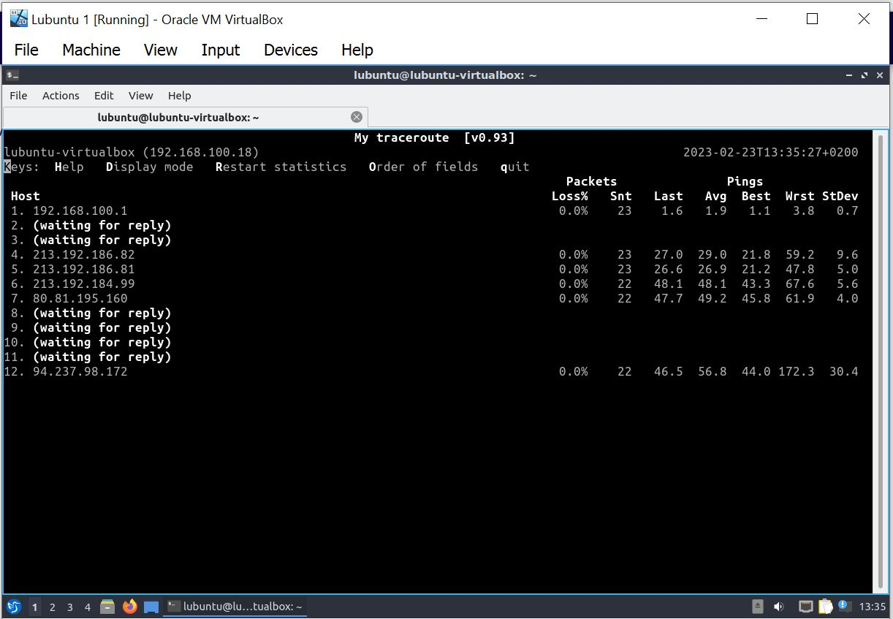

# Documentation for E01


## 1. Virtual machine Network settings

MAC address: `080027150246`


## 2. Here is the answers for the questions (What is this virtual machine useful for without a network connection? What can you do with it?
## Is there anypoint in computers without network connectivity?

```
### 1. Virtual Machine is useful without network connection

+ It is used as a training tool for learning new software or operating systems.
+ It can be useful for developers who need to work on a project in a secure environment.
+ It is used to test software applications in a safe environment.

### 2.  
Many tools and applications are used without network connectivity in the offline like word processors, 
design programs, spreedsheet software for task like writing, editing, creating art and calculations

```


## 3. Here is the ping command 

```
lubuntu@lubuntu-virtualbox:~$ ping www.jamk.fi
PING www.jamk.fi (94.237.98.172) 56(84) bytes of data.
64 bytes from 94-237-98-172.de-fra1.upcloud.host (94.237.98.172): icmp_seq=1 ttl=52 time=48.2 ms
64 bytes from 94-237-98-172.de-fra1.upcloud.host (94.237.98.172): icmp_seq=2 ttl=52 time=44.8 ms
64 bytes from 94-237-98-172.de-fra1.upcloud.host (94.237.98.172): icmp_seq=3 ttl=52 time=61.5 ms
64 bytes from 94-237-98-172.de-fra1.upcloud.host (94.237.98.172): icmp_seq=4 ttl=52 time=53.8 ms
^C
--- www.jamk.fi ping statistics ---
4 packets transmitted, 4 received, 0% packet loss, time 3006ms
rtt min/avg/max/mdev = 44.793/52.075/61.536/6.341 ms
```
## 4.1. Here is the traceroute -I command 

```
lubuntu@lubuntu-virtualbox:~$ traceroute -I www.jamk.fi
traceroute to www.jamk.fi (94.237.98.172), 64 hops max
  1   192.168.100.1  1,974ms  7,638ms  1,074ms 
  2   *  *  * 
  3   *  *  * 
  4   213.192.186.82  49,125ms  25,363ms  23,773ms 
  5   213.192.186.81  22,600ms  22,953ms  27,276ms 
  6   213.192.184.99  44,824ms  46,871ms  57,355ms 
  7   80.81.195.160  53,466ms  56,909ms  46,066ms 
  8   *  *  * 
  9   *  *  * 
 10   *  *  * 
 11   *  *  * 
 12   94.237.98.172  60,279ms  44,560ms  46,370ms 
lubuntu@lubuntu-virtualbox:~$ 

```
## 4.2. Here is the traceroute -I --resolve-hostnames command

```
lubuntu@lubuntu-virtualbox:~$ traceroute -I --resolve-hostnames www.jamk.fi 
traceroute to www.jamk.fi (94.237.98.172), 64 hops max
  1   192.168.100.1 (elisa.home)  1,044ms  1,173ms  1,115ms 
  2   *  *  * 
  3   *  *  * 
  4   213.192.186.82 (213.192.186.82)  42,672ms  23,416ms  22,821ms 
  5   213.192.186.81 (ae3.bbr1.hel2.fi.ip4.elisa.net)  26,317ms  33,809ms  31,506ms 
  6   213.192.184.99 (213.192.184.99)  44,265ms  47,094ms  46,800ms 
  7   80.81.195.160 (r2-fra1-lo0.de.net.upcloud.com)  61,176ms  59,777ms  54,324ms 
  8   *  *  * 
  9   *  *  * 
 10   *  *  * 
 11   *  *  * 
 12   94.237.98.172 (94-237-98-172.de-fra1.upcloud.host)  58,341ms  63,863ms  59,325ms 
lubuntu@lubuntu-virtualbox:~$ 

```
## 5. Here is my mtr, mtr-n command

mtr command screenshot


mtr-n command screenshot

