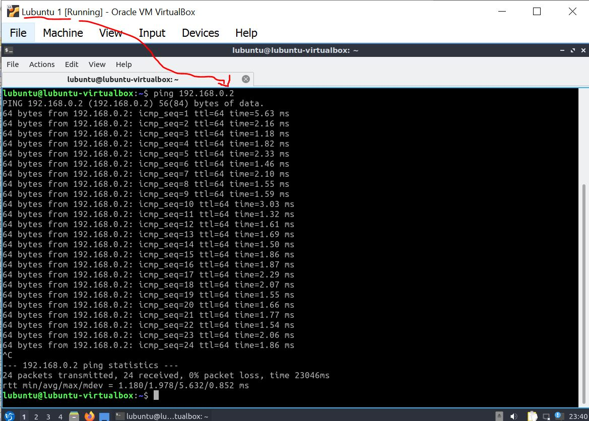
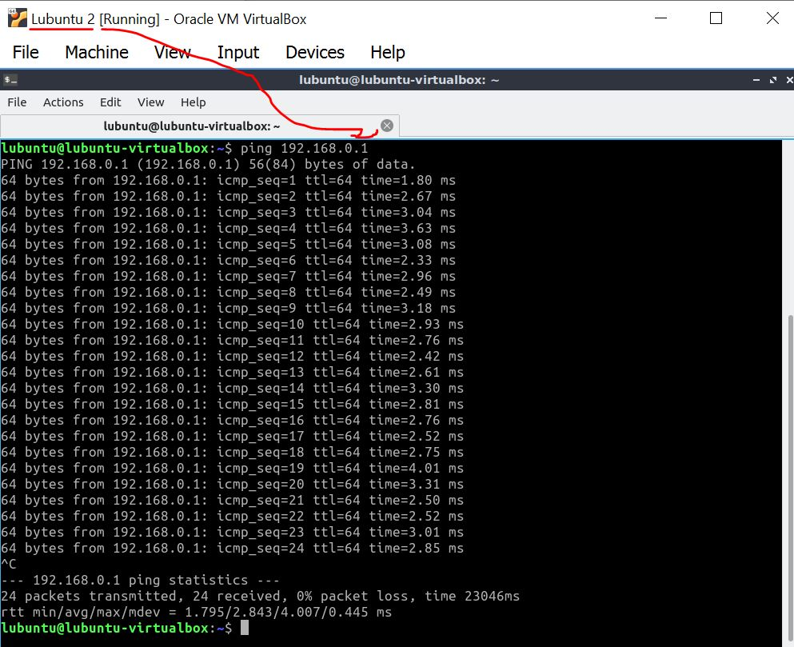
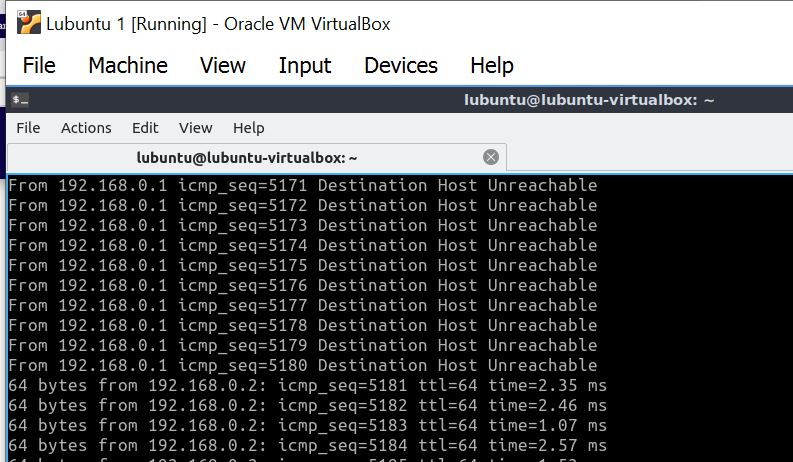
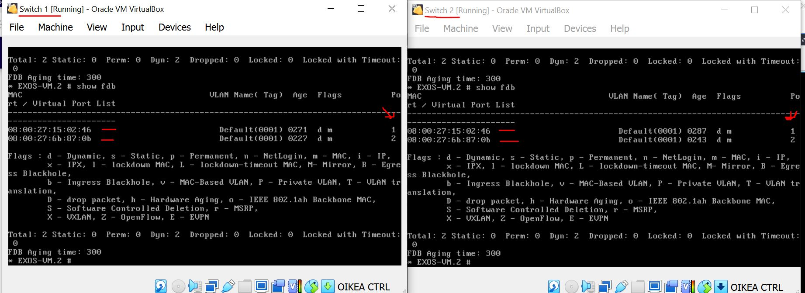

# Documentation for E02


## 1. The complete drawing of topology with switches ,adaptors VLANS

```
	The topology diagram illustrates the detailed telecommunication network transmit
	data through wireless transmitters or cables.
 
 ```

* [topology](/E02/E02topology.drawio)
	
	or


## 2. Switch configuration
 ```
 * Various configuration steps done on switches at different stages and they are saved using the 
 command save
 * The configuration is written onto the hard disk of the switch. 
 * The virtual machine switch will remember the configuration even after restarting/booting the virtual machine.
 * The configurations of both switches are saved and its details are in the following document.
 
  ```

* [Switch1](/E02/Switch1.cfg)

* [Switch2](/E02/Switch2.cfg)

	

## 3. command show ports info. 

``` 
	* The state of the port is verified using the command 
    * show ports info 
	  details  showed in the image.
```


## 4. command ip addr

``` The operating system Ip-address is verified in the lubuntu Qterminal using the command 
	ip addr
	the results are showed in the image.
```


## 5. Testing connectivity

``` Connectivity test  is verified using the command ping.
	Depending on virtual machine terminal we are ping the opposing machine's IP-address.
	Both the machines connectivity is shown in the below images.
```
```
Lubuntu1 should ping 192.168.0.2 
```


```
 Lubuntu2 should ping 192.168.0.1.
 ```
 
 
 ``` 
* If the ping left on while doing changes in the network configuration, 
the ping stopped when we were doing the network configuration changes
* we observe Destination Host Unreachable
* Continued once working configuration is in place
Both the results are shown in the below image.

 ```
  
  

 
 ## 6. show fdb
 
 ```
 Command show fdb forwarding tables of the switches can be seen 
 
 ```
  
  
  
 ## 7. Wiresharking an Ethernet Frame


 
  
``` 
	The recordings on wireshark for LAN2 connection is shown in the below screenshot
	Check the following fields for the above recordings for the frame2
	1.Find the source MAC address   08:00:27:6b:87:0b
	2.What is the Ethertype     (0x0800)
	3.Find the source IP address  192.168.0.2
	4.What is the Payload of the Ethernet frame in the selected capture row?  ICMP

```