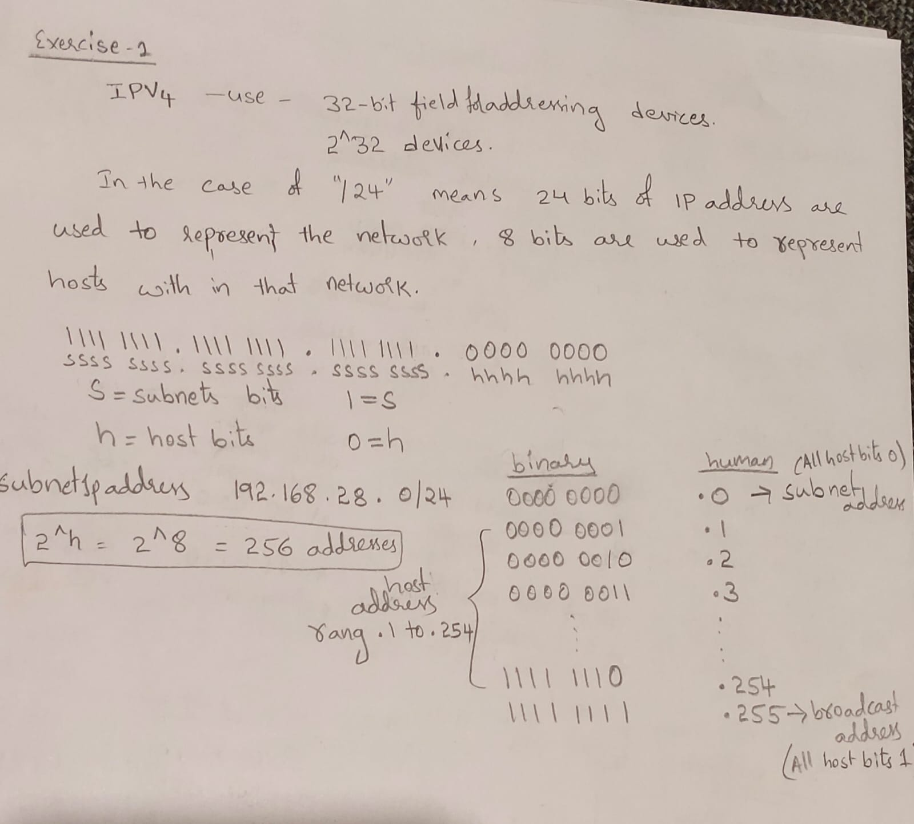

# Documentation for E03

```

                            vvxyzki
Rajeshwari_student_number = 2210528

10.10.05.0/24 and
192.168.28.0/24
```
### Exercise 1
```
Calculating Networks

What is the usable (host) address range of 192.168.ki.0/24? 
192.168.28.1 to 192.168.28.254

What is the broadcast address? 
192.168.28.255
What is the subnet address?
192.168.28.0
```




### Exercise 2

```
Divide the 192.168.ki.0/24 into smaller subnets with (atleast) 50 hosts in each. Notice! Make as small of a subnet/subnets as you can!

Fill the subnet info column with your information, add more columns if necessary:
```
```

Specification                                       Subnet info
Network address                                     192.168.28.0
New subnet mask                                     255.255.255.192 (/26)
Number of usable (host) addresses in the subnet     62
First IP Host address                               192.168.28.1
Last IP Host address                                192.168.28.62
Broadcast address                                   192.168.28.63

Specification                                       Subnet info
Network address                                     192.168.28.64
New subnet mask                                     255.255.255.192 (/26)
Number of usable (host) addresses in the subnet     62
First IP Host address                               192.168.28.65
Last IP Host address                                192.168.28.126
Broadcast address                                   192.168.28.127

Specification                                       Subnet info
Network address                                     192.168.28.128
New subnet mask                                     255.255.255.192 (/26)
Number of usable (host) addresses in the subnet     62
First IP Host address                               192.168.28.129
Last IP Host address                                192.168.28.190
Broadcast address                                   192.168.28.191

Specification                                       Subnet info
Network address                                     192.168.28.192
New subnet mask                                     255.255.255.192 (/26)
Number of usable (host) addresses in the subnet     62
First IP Host address                               192.168.28.193
Last IP Host address                                192.168.28.254
Broadcast address                                   192.168.28.255
```


### Exercise 3
```
Divide the 10.xy.yz.0/24 into smaller subnets:

The subnets have to be as small as possible (usable hosts)
The subnets must have the capability to support 13 hosts in each of the subnets
Fill the subnet info column with your information:
```

```
Specification	                                    Subnet info
New subnet mask (decimal or slash format)	        255.255.255.240 or /28
Number of usable hosts in the subnet	            14

1. subnet
Specification	                                    Subnet info

Network address	                                    10.10.05.0
First IP Host address	                            10.10.05.1
Last IP Host address	                            10.10.05.14
Broadcast address                                   10.10.05.15	

2.subnet
Specification	                                    Subnet info

Network address	                                    10.10.05.16
First IP Host address	                            10.10.05.17
Last IP Host address	                            10.10.05.30
Broadcast address                                   10.10.05.31	

3.subnet
Specification	                                    Subnet info

Network address	                                    10.10.05.32
First IP Host address	                            10.10.05.33
Last IP Host address	                            10.10.05.46
Broadcast address                                   10.10.05.47	

4. subnet
Specification	                                    Subnet info

Network address	                                    10.10.05.48
First IP Host address	                            10.10.05.49
Last IP Host address	                            10.10.05.62
Broadcast address                                   10.10.05.63	

5. subnet
Specification	                                    Subnet info

Network address	                                    10.10.05.64
First IP Host address	                            10.10.05.65
Last IP Host address	                            10.10.05.78
Broadcast address                                   10.10.05.79	


6. subnet
Specification	                                    Subnet info

Network address	                                    10.10.05.80
First IP Host address	                            10.10.05.81
Last IP Host address	                            10.10.05.94
Broadcast address                                   10.10.05.95	


7. subnet
Specification	                                    Subnet info

Network address	                                    10.10.05.96
First IP Host address	                            10.10.05.97
Last IP Host address	                            10.10.05.110
Broadcast address                                   10.10.05.111


8. subnet

Network address	                                    10.10.05.112
First IP Host address	                            10.10.05.113
Last IP Host address	                            10.10.05.126
Broadcast address                                   10.10.05.127

9. subnet
Specification	                                    Subnet info

Network address	                                    10.10.05.128
First IP Host address	                            10.10.05.129
Last IP Host address	                            10.10.05.142
Broadcast address                                   10.10.05.143

10. subnet
Specification	                                    Subnet info

Network address	                                    10.10.05.144
First IP Host address	                            10.10.05.145
Last IP Host address	                            10.10.05.158
Broadcast address                                   10.10.05.159

11. subnet
Specification	                                    Subnet info

Network address	                                    10.10.05.160
First IP Host address	                            10.10.05.161
Last IP Host address	                            10.10.05.174
Broadcast address                                   10.10.05.175

11. subnet
Specification	                                    Subnet info

Network address	                                    10.10.05.160
First IP Host address	                            10.10.05.161
Last IP Host address	                            10.10.05.174
Broadcast address                                   10.10.05.175

12. subnet
Specification	                                    Subnet info

Network address	                                    10.10.05.176
First IP Host address	                            10.10.05.177
Last IP Host address	                            10.10.05.190
Broadcast address                                   10.10.05.191

13. subnet
Specification	                                    Subnet info

Network address	                                    10.10.05.192
First IP Host address	                            10.10.05.193
Last IP Host address	                            10.10.05.206
Broadcast address                                   10.10.05.207

14. subnet
Specification	                                    Subnet info

Network address	                                    10.10.05.208
First IP Host address	                            10.10.05.209
Last IP Host address	                            10.10.05.222
Broadcast address                                   10.10.05.223

15. subnet
Specification	                                    Subnet info

Network address	                                    10.10.05.224
First IP Host address	                            10.10.05.225
Last IP Host address	                            10.10.05.238
Broadcast address                                   10.10.05.239

16. subnet
Specification	                                    Subnet info

Network address	                                    10.10.05.240
First IP Host address	                            10.10.05.241
Last IP Host address	                            10.10.05.254
Broadcast address                                   10.10.05.255

```


### Exercise 4
```
Divide the last subnet, of from exercise 3, into smaller subnets:

The subnets have to be as small as possible (usable hosts)
The subnets must have the capability to support 2 hosts in each of the subnets
Fill the subnet info column with your information:
```

```
Specification	                                    Subnet info
New subnet mask (decimal or slash format)	        255.255.255.252 or /30
Number of usable hosts in the subnet	            2

1. subnet
Specification	                Subnet info
	
Network address	                10.10.05.240
First IP Host address	        10.10.05.241
Last IP Host address	        10.10.05.242
Broadcast address               10.10.05.243

2. subnet
Specification	                Subnet info
	
Network address	                10.10.05.244
First IP Host address	        10.10.05.245
Last IP Host address	        10.10.05.246
Broadcast address               10.10.05.247

3. subnet
Specification	                Subnet info
	
Network address	                10.10.05.248
First IP Host address	        10.10.05.249
Last IP Host address	        10.10.05.250
Broadcast address               10.10.05.251

3. subnet
Specification	                Subnet info
	
Network address	                10.10.05.252
First IP Host address	        10.10.05.253
Last IP Host address	        10.10.05.254
Broadcast address               10.10.05.255
```


### Exercise 5

```
Is subnet 10.xy.yz.0/24 a part of the supernet 10.xy.16.0/20?

subnet 10.10.05.0/24 part of supernet 10.10.16.0/20
  binary 10.10.05.0/24    0000 1010.0000 1010.0000 0101.0000 0000
  binary 10.10.16.0/20    0000 1010.0000 1010.0001 0000.0000 0000 

1st supernet        
hhhh.hhhh hhhh         32-20(s) = 12(h)
0000.0000 0000      0.0     10.10.0.0/20
                    1.0
                    2.0
                    3.0
                    4.0
                    5.0    10.10.05.0/24 is part of supernet 10.10.0.0/20
                    ..
1111.1111 1111      15.255


2nd supernet
ssss hhhh.hhhh hhhh     
0001 0000.0000 0000     16.0    10.10.16.0/20
                        17.0
                        ..
0001 1111.1111 1111     31.255                  

by above information 10.10.05.0/24 subnet is not a part of 10.10.16.0/20 supernet.


```
### Exercise 6

```
Is subnet 10.xy.yz.0/24 a part of supernet 10.0.0.0/8?

subnet 10.10.05.0/24 part of supernet 10.0.0.0/8

  binary 10.10.05.0/24    0000 1010.0000 1010.0000 0101.0000 0000

    supernet   10.0.0.0/8       
   net mask   255.0.0.0

ssss ssss.hhhh hhhh.hhhh hhhh.hhhh hhhh          32-8(s)= 24(h)
0000 1010.0000 0000.0000 0000.0000 0000       10.0.0.0    Network address	
0000 1010.0000 0000.0000 0000.0000 0001       10.0.0.1     First IP Host address
......                                        .....
.....                                         .....
0000 1010.1111 1111.1111 1111.1111 1110       10.255.255.254    Last IP Host address
0000 1010.1111 1111.1111 1111.1111 1111       10.255.255.255       Broadcast address 

10.10.05 is in the range of IP host address 10.0.0.1 to 10.255.255.244

There fore subnet 10.10.05.0/24 is the part of super net 10.0.0.0/8
```

### Internet Registries

```
Fill the following addresses with your student number: 195.xy.yz.0/24, 43.xy.ki.0/24, 15.ki.xy.0/24 and 100.yz.ki.0/24
```

```

                            vvxyzki
Rajeshwari_student_number = 2210528

195.10.05.0/24 -RIPE 43.10.28.0/24 -APNIC, 15.28.10.0/24  -ARIN 100.05.28.0/24  -ARIN

```


https://lookup.icann.org/en/lookup
